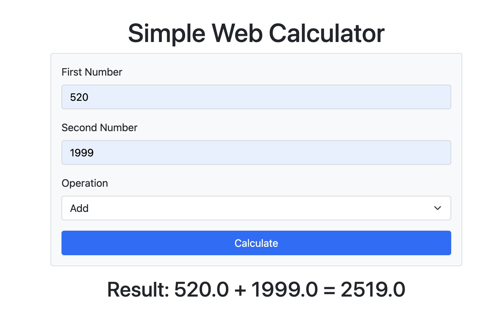

# Web Calculator

This repository contains a simple web-based calculator that performs basic arithmetic operations. It is built using Python with Flask framework, and can be run inside a Docker container.



## Features

- Perform addition, subtraction, multiplication, and division.
- User-friendly web interface.

## Prerequisites

Ensure you have Docker installed on your machine. You can download Docker from [Docker's official website](https://www.docker.com/products/docker-desktop).

## Installation and Running the App

1. Clone the repository to your local machine or download the source code.

2. Navigate to the directory containing the Dockerfile.

3. Build the Docker image:
   ```bash
   docker build -t web-calculator .
   ```
4. Run the Docker container:
   ```bash
   docker run -p 3000:3000 web-calculator
   ```
5. Open your web browser and access the calculator at:
   ```bash
   http://127.0.0.1:3000
   ```


[def]: sampl